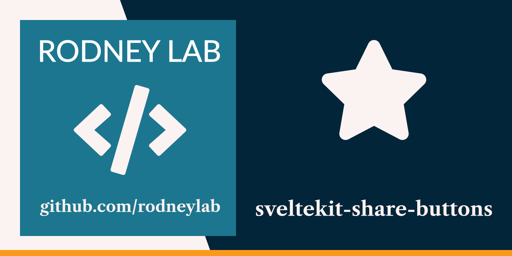

<p align="center">
  <a aria-label="Open Rodney Lab site" href="https://rodneylab.com" rel="nofollow noopener noreferrer">
    
  </a>
</p>
<h1 align="center">
  SvelteKit Share Buttons
</h1>

# sveltekit-share-buttons

## 🌏  Open in the Cloud 

Click any of the buttons below to start a new development environment to demo or contribute to the codebase without having to install anything on your machine:

[](https://vscode.dev/github/rodneylab/sveltekit-share-buttons)
[](https://glitch.com/edit/#!/import/github/rodneylab/sveltekit-share-buttons)
[](https://codespaces.new/rodneylab/sveltekit-share-buttons)
[](https://codesandbox.io/s/github/rodneylab/sveltekit-share-buttons)
[](https://stackblitz.com/github/rodneylab/sveltekit-share-buttons)
[](https://replit.com/github/rodneylab/sveltekit-share-buttons)
[](https://app.codeanywhere.com/#https://github.com/rodneylab/sveltekit-share-buttons)
[](https://gitpod.io/#https://github.com/rodneylab/sveltekit-share-buttons)


Code showing how to use the Web Share API with progressive enchancements to add social share buttons to a Svelte app. The code accompanies the <a aria-label="Open Rodney Lab post on Svelte share buttons" href="https://rodneylab.com/svelte-share-buttons/">post on Svelte share buttons</a>. If you have any questions, please drop a comment at the bottom of that page.

## Building and previewing the site

If you're seeing this, you've probably already done this step. Congrats!

```bash
git clone https://github.com/rodneylab/svelte-share-buttons.git
cd svelte-share-buttons
pnpm install # or npm install
cp .env.EXAMPLE .env
pnpm run dev
```

## Building

```bash
pnpm run build
```

> You can preview the built app with `pnpm run preview`, regardless of whether you installed an adapter. This should _not_ be used to serve your app in production.

CREDIT: button sharing code based on https://github.com/nygardk/react-share by Klaus Nygård.
